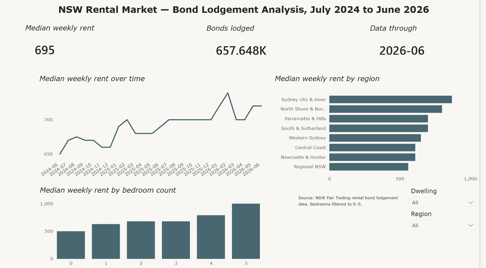

# NSW Rental Market — Bond Lodgement Dashboard

An interactive Power BI dashboard tracking rental prices across New South Wales, built from NSW Fair Trading's rental bond lodgement records.



## Data

**Source:** [NSW Fair Trading rental bond lodgement data](https://www.nsw.gov.au/housing-and-construction/rental-forms-surveys-and-data/rental-bond-data)

**Period:** July 2024 – June 2026 (24 monthly files)

**Records:** 657,648 bond lodgements

Every residential tenancy bond in NSW must be lodged with NSW Fair Trading, so the dataset captures close to the full population of new rental agreements rather than a survey sample.

## What it does

- **Median weekly rent over time** — monthly trend across the full period
- **Median weekly rent by region** — eight regions, ranked
- **Median weekly rent by bedroom count** — studios through five bedrooms
- **Headline cards** — statewide median, total lodgements, data currency
- **Cross-filtering slicers** — region and dwelling type filter every visual simultaneously

## Build

| Stage | Approach |
|---|---|
| Ingestion | Power Query folder connector, combining 24 monthly Excel files |
| Cleaning | Postcode-to-region mapping and dwelling-type decoding via conditional columns |
| Modelling | DAX calculated column deriving `YYYY-MM` month from lodgement date |
| Visualisation | Power BI Desktop |

The folder connector means adding a new month is a refresh, not a rebuild.

## Findings

**Rents rose roughly 7% over two years,** from a median of $650 in mid-2024 to $695 by mid-2026, with the steepest movement in early 2026.

**The geographic spread is wide.** Sydney city and inner suburbs sit at $870 against $560 in Regional NSW — a gap of about 55%.

**The third bedroom is nearly free.** Two- and three-bedroom properties share almost the same median (~$690), while the fourth bedroom adds around $110. Statewide, size buys less than you would expect.

**That flat gradient is a composition effect, not a market fact.** Large properties are disproportionately located in cheaper regions, so the statewide bedroom curve is confounded by geography. Filter to Sydney city and inner and the five-bedroom median doubles to $2,000; filter to Regional NSW and it falls to around $870. The premium for space is real and substantial — it is simply invisible until location is held constant.

## Limitations

**Bond lodgements are new leases only.** Existing tenancies do not re-lodge, so this measures the price of entering the market, not the rent being paid across the whole rental stock. It moves faster than the underlying market and is not comparable to advertised asking rents.

**Bedrooms filtered to 0–5.** The raw data contains values up to 30, reflecting boarding houses, student accommodation, and probable data-entry errors. These distorted the axis without adding signal.

**"Other" includes non-dwellings.** NSW Fair Trading's `O` code covers rented rooms, garages, and car spaces, which sit well below residential rents and drag the low end of the distribution.

**Dwelling type is self-reported** by the agent or landlord, and a small share of records arrive with no code at all — shown here as "Not recorded" rather than silently dropped.

**High-end properties are underrepresented.** Premium rentals more often let outside the standard bond system or through corporate arrangements.

## Files

```
├── README.md
├── Sydney-rental-dashboard.pbix
└── screenshots/
├── dashboard-overview.png
├── filtered-sydney-inner.png
└── filtered-regional-nsw.png
```


---

Built by Thanh Nhan Nguyen · [LinkedIn](https://www.linkedin.com/in/thanh-nhan-nguyen-a9a06b1b9)
